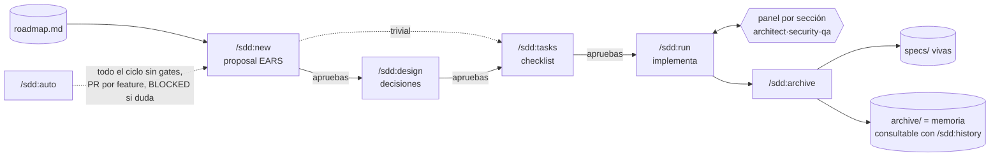

# SDD Toolkit — plugin de Claude Code

Flujo de **Spec-Driven Development** como plugin de Claude Code, inspirado en [OpenSpec](https://github.com/Fission-AI/OpenSpec) con la simplicidad de Kiro: tres documentos por cambio, un flujo lineal con puertas de aprobación, specs vivas, **panel multiagente de revisión** (architect/security/qa), **modo autónomo** con PRs, **métricas de tokens/coste por feature** y un **registro de decisiones consultable**.

> **¿Primera vez?** Empieza por la [guía de uso paso a paso](docs/guide.md) — este README es la referencia.



## Filosofía

1. **Specs antes que código.** Cada cambio nace como propuesta con requisitos verificables (EARS), pasa por diseño y se descompone en tareas antes de tocar código.
2. **Dos espacios:** `sdd/specs/` (verdad viva: qué hace el sistema hoy) y `sdd/changes/` (propuestas en curso que, al completarse, actualizan las specs y se archivan).
3. **Simple estilo Kiro.** `proposal.md` + `design.md` (opcional si trivial) + `tasks.md`, con aprobación explícita entre fases.
4. **El proyecto guarda los datos; el plugin, la lógica.** `sdd/` en cada repo es pura persistencia (specs, changes, steering, roadmap, métricas) — sobrevive a actualizaciones del plugin y a cambios de máquina.
5. **Los documentos son referentes ejecutables.** Las reglas de steering guían la generación *y* las verifica el panel; el archivo de changes es un registro de decisiones con citas (`/sdd:history`). Nada se revisa ni se recuerda "de memoria".

## Instalación

```
/plugin marketplace add hardcode83/sdd-toolkit   # o ruta local al clon
/plugin install sdd@sdd-toolkit
```

Después, en cada proyecto: `/sdd:init` (acepta un doc de planificación: `/sdd:init docs/plan.md`).

Actualizar: `/plugin marketplace update sdd-toolkit` + `/plugin update sdd@sdd-toolkit` (con el repo en git, cada commit es una versión; el campo `version` de `plugin.json` marca releases explícitas).

## Comandos

| Comando | Qué hace | Modelo |
|---|---|---|
| `/sdd:init [plan.md]` | Bootstrap: steering docs, scaffold, baseline de specs (brownfield), roadmap desde un plan (greenfield), extras (MCPs, LSPs, métricas). Re-ejecutable: detecta lo ya inicializado y hace merge, no regenera. | sonnet |
| `/sdd:new [feature]` | Proposal con user stories EARS (3-7 requisitos). Sin argumento, coge la siguiente entrada del roadmap. | opus |
| `/sdd:design [feature]` | Diseño técnico con decisiones y alternativas. Se salta si el cambio es trivial. | opus |
| `/sdd:tasks [feature]` | Checklist de tareas pequeñas y verificables que referencian requisitos `[R1]`. | sonnet |
| `/sdd:run [feature] [next]` | Implementa en orden, verifica antes de marcar `[x]`, para si la realidad contradice la spec. | sonnet |
| `/sdd:archive [feature]` | Fusiona en las specs vivas (spec on first touch), consolida métricas y archiva. | haiku |
| `/sdd:status` | Changes activos + roadmap como to-do list. | haiku |
| `/sdd:review [feature]` | Sin argumento: drift specs↔código. Con feature: valida implementación vs proposal. | sonnet |
| `/sdd:auto [N\|feature]` | Modo autónomo: ejecuta las próximas N entradas del roadmap de punta a punta, una rama+PR por feature, cola BLOCKED para lo que necesite decisión humana. | sonnet |
| `/sdd:history [feature\|pregunta]` | La memoria del proyecto: timeline de changes archivados, ficha completa de uno (decisiones + alternativas rechazadas + coste + commits), o arqueología de decisiones con citas y chequeo de vigencia. | haiku |
| `/sdd:diagram` | Genera diagramas (Mermaid/PlantUML: flowcharts, secuencia, C4, ER, infra AWS) a `~/diagrams/`. La fase design lo usa para ilustrar decisiones. Requiere `mmdc`/`plantuml`. | — |

Cada fase termina **esperando aprobación** — nunca encadena a la siguiente sola (excepto `/sdd:auto`, que sustituye los gates por sus equivalentes automáticos).

## Modelos y agentes por fase

Qué modelo ejecuta cada fase y qué subagentes intervienen en ella:

| Fase | Modelo | Agentes que intervienen |
|---|---|---|
| `init` | sonnet | — |
| `new` | **opus** | — (gate humano; en auto: auto-check vs roadmap + product.md) |
| `design` | **opus** | en modo auto: `sdd-architect` pre-aprueba el design antes de codificar |
| `tasks` | sonnet | — (check de cobertura R#→tareas) |
| `run` | sonnet | **panel por sección**: `sdd-architect` + `sdd-security` + `sdd-qa` en paralelo; en `tournament`: 3 implementadores en worktrees + panel como juez |
| `review` | sonnet | el mismo panel, a escala feature |
| `archive` | haiku | — |
| `status` / `history` | haiku | — (solo lectura) |
| `auto` | sonnet (orquestador) | todos los anteriores según la fase que esté ejecutando |

Los agentes del panel (`agents/`) tienen su propio modelo y contrato:

| Agente | Modelo | Referente que verifica | Regla |
|---|---|---|---|
| `sdd-architect` | sonnet | `design.md` (D#) + `steering/architecture.md` | Desviación del design = finding aunque funcione; design obsoleto = `DESIGN-CONFLICT`, nunca parche |
| `sdd-security` | **opus** | `steering/security.md` regla a regla; sin ese doc, solo clases objetivas con evidencia | Cita la regla o el input→sink; sin evidencia no reporta |
| `sdd-qa` | sonnet | criterios EARS del proposal + `steering/testing.md` | Por cada R#: ¿implementado? ¿testeado de verdad? ¿aguanta? — ejecuta tests, intenta romper |

**Cómo cambiar la configuración**: el modelo de una fase se edita en el frontmatter `model:` de `skills/<fase>/SKILL.md`; el de un agente, en `agents/sdd-*.md`. Es configuración del plugin (no por proyecto): editar, commitear y subir versión aplica a todos tus proyectos. El override de modelo dura solo esa invocación — la sesión vuelve a tu modelo al terminar.

## Estructura en el proyecto destino

```
proyecto/
├── .mcp.json                   # MCPs opcionales (escrito por /sdd:init)
├── .claude/settings.json       # env de telemetría si activas métricas
├── CLAUDE.md                   # puntero SDD (bloque idempotente)
└── sdd/                        # ← LA CAPA DE PERSISTENCIA
    ├── project.md              # steering core: stack, comandos (se lee siempre)
    ├── roadmap.md              # (opcional) backlog ordenado de futuros changes
    ├── metrics.md              # (opcional) tokens/coste por feature archivada
    ├── steering/               # reglas ricas de carga selectiva (frontmatter applies_to/phases)
    ├── specs/                  # verdad viva, una capability por .md
    └── changes/
        ├── <feature>/          # proposal.md · design.md · tasks.md · metrics.md
        │                       # (+ BLOCKED.md si el modo auto necesita tu decisión)
        └── archive/2026-07-15-<feature>/   # memoria del proyecto → /sdd:history
```

## Steering: instrucciones permanentes con carga selectiva

`sdd/steering/` guarda visión (`product.md`), arquitectura, seguridad, testing, documentación y convenciones por componente/lenguaje. Cada doc declara cuándo se carga:

```yaml
---
applies_to: ["frontend/**"]   # omitir = todo cambio
phases: [design, run]         # omitir = todas las fases
---
```

Un cambio de FE nunca carga la guía de infra; la visión pesa al proponer/diseñar sin ocupar contexto al implementar. Reglas vinculantes: un design que rompa architecture/security debe declararlo como open question. Detalles en `references/steering.md`.

## Adopción

- **Brownfield**: `/sdd:init` genera steering desde el código y ofrece baseline de las 3-6 capabilities core; el resto se documenta al tocarlo (`/sdd:archive` → spec on first touch). Trabajo a medias se adopta pre-marcando tareas verificadas.
- **Greenfield con plan**: `/sdd:init plan.md` triaja: visión → steering, decisiones → project/architecture, features → `roadmap.md`. Los proposals se escriben just-in-time, anclados a las specs ya construidas. Re-ingestas posteriores hacen merge (lo hecho es historia; lo que contradice specs construidas se señala como candidato a `/sdd:new`).

## Panel multiagente de calidad

`/sdd:run` lanza, **al cerrar cada sección de tareas** que toca código de producción, tres revisores en paralelo (`agents/`): **sdd-architect** (diff vs `design.md` + steering de arquitectura), **sdd-security** (diff vs `security.md` o clases objetivas de vulnerabilidad, en opus) y **sdd-qa** (cada criterio EARS: ¿implementado? ¿testeado? ¿se puede romper? — ejecuta los tests). La regla que mantiene el panel útil: **ningún finding sin referente** (R#, decisión D# o regla de steering citada) — sin referente, se descarta. Máximo 2 rondas de fix por sección; los `DESIGN-CONFLICT` van por la deviation rule (actualizar el design con el usuario), nunca como parche silencioso.

`/sdd:review <feature>` usa el mismo panel a escala feature antes de archivar. Modos de `run`: `solo` (sin panel, para changes de scaffolding) y `tournament <task>` (3 implementaciones paralelas en worktrees aisladas + el panel como juez — ~3× coste, solo para tareas con varianza real de solución; nunca por defecto). El coste del panel es visible en las métricas por feature (los subagentes computan como `query_source=subagent`), así que puedes ajustar su agresividad con datos.

## Modo autónomo (`/sdd:auto`)

Ejecuta features del roadmap **sin intervención**, sustituyendo cada gate humano por su equivalente automático: el scope lo pre-autoriza el roadmap (auto jamás inventa features), la aprobación del design la hace `sdd-architect` antes de codificar, el panel es obligatorio por sección, y `review` debe dar PASS antes de archivar. Tu revisión no desaparece — se mueve: **una rama + PR por feature** (con proposal, veredicto del panel y specs dentro), y todo lo que antes era "pregunta al usuario" se convierte en **BLOCKED** (`changes/<feature>/BLOCKED.md` con la decisión pendiente, rama commiteada, y sigue con la siguiente). `/sdd:status` muestra la cola BLOCKED primero — es tu bandeja de decisiones.

Lanzamiento: `/sdd:auto 1` en sesión normal para calibrar; desatendido vía headless (`claude -p "/sdd:auto 2" --permission-mode acceptEdits` en cron/CI). Precondiciones: árbol git limpio y steering docs concretos — en auto el panel es el único revisor durante la ejecución, y es tan bueno como tus referentes.

## Métricas de uso por feature

Extra opcional de `/sdd:init`: tokens reales + coste estimado desde la concepción al archivado, **subagentes incluidos**. Fuente: el export OTel nativo de Claude Code (`claude_code.token.usage`) recibido por un sink OTLP local (`scripts/usage-sink.py`, Python stdlib) que etiqueta cada datapoint con la fase activa. Ledger por change (`metrics.md`) + consolidado en `sdd/metrics.md`. Límites documentados en `references/metrics.md`.

## Extras por proyecto

`/sdd:init` ofrece según el stack detectado, con diff contra lo ya activado en re-ejecuciones:

- **MCPs** (`references/mcp-catalog.md`): GitHub, Atlassian, Playwright, Context7, Postgres, Sentry… → `.mcp.json` (merge).
- **LSPs** (`references/lsp-catalog.md`): instala binarios con aprobación e imprime los `/plugin install` de los plugins LSP oficiales.
- **Puntero en CLAUDE.md** y **métricas** (arriba).
- **rtk** ([Rust Token Killer](https://www.rtk-ai.app)): el plugin trae de serie un hook PreToolUse (`hooks/hooks.json` → `scripts/rtk-rewrite.sh`) que reescribe los comandos Bash vía `rtk rewrite` para ahorrar 60-90% de tokens en operaciones de desarrollo. Sin el binario instalado es un no-op silencioso; el init solo ofrece instalarlo (`brew install rtk-ai/tap/rtk` o `cargo install rtk`) si falta.

## Estructura del plugin

```
.claude-plugin/{plugin,marketplace}.json
rules.md            # reglas compartidas que toda fase lee primero
skills/<fase>/      # init·new·design·tasks·run·archive·status·review·auto·history·diagram
agents/             # panel: sdd-architect · sdd-security · sdd-qa
hooks/hooks.json    # hook rtk (PreToolUse Bash, no-op sin binario)
templates/          # proposal/design/tasks/spec/roadmap + steering/ + scaffold/
references/         # steering · mcp-catalog · lsp-catalog · metrics
scripts/            # usage-{mark,phase,sink} · rtk-rewrite.sh
docs/guide.md       # guía de uso narrativa
```

Para añadir una fase propia: carpeta en `skills/` + entrada en `rules.md`. Para tus MCPs/LSPs: edita los catálogos.
