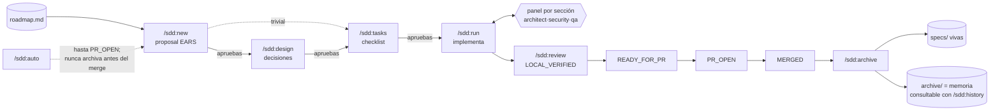

# SDD Toolkit — plugin de Claude Code

Flujo de **Spec-Driven Development** como plugin de Claude Code, inspirado en [OpenSpec](https://github.com/Fission-AI/OpenSpec) con la simplicidad de Kiro: tres documentos por cambio, un flujo lineal con puertas de aprobación, specs vivas, **panel multiagente de revisión** (architect/security/qa), **modo autónomo** con PRs, **métricas de tokens/coste por feature** y un **registro de decisiones consultable**.

> **¿Primera vez?** Empieza por la [guía de uso paso a paso](docs/guide.md) — este README es la referencia. Los *porqués* del diseño (y las preguntas que te harás usándolo) están en la [FAQ](docs/faq.md).


```mermaid
flowchart LR
    R[("roadmap.md")] --> N["/sdd:new<br/>proposal EARS"]
    N -->|apruebas| D["/sdd:design<br/>decisiones"]
    N -.->|trivial| T
    D -->|apruebas| T["/sdd:tasks<br/>checklist"]
    T -->|apruebas| RU["/sdd:run<br/>implementa"]
    RU <--> P{{"panel por sección<br/>architect·security·qa"}}
    RU --> V["/sdd:review<br/>LOCAL_VERIFIED"]
    V --> RP["READY_FOR_PR"]
    RP --> PR["PR_OPEN"]
    PR --> M["MERGED"]
    M --> A["/sdd:archive"]
    A --> S[("specs/ vivas")]
    A --> H[("archive/ = memoria<br/>consultable con /sdd:history")]
    AUTO["/sdd:auto"] -. "hasta PR_OPEN;<br/>nunca archiva antes del merge" .-> N
```

## Filosofía

1. **Specs antes que código.** Cada cambio nace como propuesta con requisitos verificables (EARS), pasa por diseño y se descompone en tareas antes de tocar código.
2. **Dos espacios:** `sdd/specs/` (verdad viva: qué hace el sistema hoy) y `sdd/changes/` (propuestas en curso que solo actualizan las specs y se archivan después de un merge verificable).
3. **Simple estilo Kiro.** `proposal.md` + `design.md` (opcional si trivial) + `tasks.md`, con aprobación explícita entre fases.
4. **El proyecto guarda los datos; el plugin, la lógica.** `sdd/` en cada repo es pura persistencia (specs, changes, steering, roadmap, métricas) — sobrevive a actualizaciones del plugin y a cambios de máquina.
5. **Los documentos son referentes ejecutables.** Las reglas de steering guían la generación *y* las verifica el panel; el archivo de changes es un registro de decisiones con citas (`/sdd:history`). Nada se revisa ni se recuerda "de memoria".

## ¿Qué vive dónde? — arquitectura de capas

| Capa | Qué contiene | Quién la escribe | Cómo cambia | Distribución / copia | ¿Depende del stack? |
|---|---|---|---|---|---|
| Plugin | skills/, agents/, templates/, references/, scripts/, hooks/, tests internos y CI | Mantenedores de este repositorio | Commit, revisión y actualización del plugin | Se instala por usuario; /sdd:init solo lee y copia los templates elegidos, nunca tests/ ni .github/workflows/ | No: su implementación puede usar Python, pero no define el stack del producto |
| Proyecto | sdd/project.md, steering/, specs/, changes/, archive/, roadmap.md, CLAUDE.md, .mcp.json, configuración y agentes del proyecto | /sdd:init, las fases SDD y el equipo | Cambios versionados en el repositorio consumidor | Viaja con el producto; los templates se materializan aquí y después son propiedad del proyecto | Sí: el proyecto declara su lenguaje, framework y comandos reales |
| Máquina | Snapshots, cachés, binarios, logs y estado local no versionado | Runtime e instaladores | Se crea y rota localmente | No se distribuye ni se copia al proyecto | Solo por disponibilidad local, nunca como fuente de verdad |

Tres capas con dueños y ciclos de vida distintos. La regla rápida: **si define *cómo* trabaja el flujo → plugin; si define *qué* es tu proyecto y bajo qué reglas → proyecto; si es efímero → máquina.**

```
┌─ 🔌 PLUGIN ─────────────── el CÓMO se trabaja ──────────────────┐
│  fases y sus modelos · agentes del panel · plantillas · catálogos │
│  vive: instalado por usuario (igual en todos tus proyectos)       │
│  cambia: /plugin update                                           │
└──────────────────────────────┬────────────────────────────────────┘
                               │  /sdd:init copia plantillas UNA vez
                               │  y las rellena; las fases leen/escriben
                               ▼
┌─ 📁 PROYECTO ───────────── el QUÉ construyes y tus REGLAS ──────┐
│  sdd/: steering (tus reglas) · specs (verdad viva) · changes ·    │
│  roadmap · métricas  +  CLAUDE.md · .mcp.json · settings.json     │
│  vive: versionado en el repo (viaja con el equipo)                │
│  cambia: tú y las fases — sobrevive a updates del plugin          │
└──────────────────────────────┬────────────────────────────────────┘
                               │  runtime
                               ▼
┌─ 💻 MÁQUINA ────────────── lo EFÍMERO ──────────────────────────┐
│  .sdd-usage/ (snapshots de uso) · binarios: rtk, mmdc, LSPs       │
│  vive: local, gitignorado — no viaja                              │
└────────────────────────────────────────────────────────────────────┘
```

| Componente | Capa | Quién lo escribe | Cómo cambia |
|---|---|---|---|
| `skills/` (fases + modelos) | Plugin | tú, en el repo del plugin | commit + subir versión → llega a todos tus proyectos vía update |
| `agents/` (panel) | Plugin | ídem | ídem |
| `templates/` (esqueletos) | Plugin | ídem | solo afecta a documentos que se creen *a partir de ahora* |
| `references/` (catálogos) | Plugin | ídem | el init los relee en cada re-ejecución |
| `scripts/` + `hooks/` | Plugin | ídem | commit + versión |
| `sdd/project.md` | Proyecto | `/sdd:init` lo genera; se edita a mano | cuando cambie stack/comandos |
| `sdd/steering/` | Proyecto | el init crea el esqueleto; **tú lo llenas de reglas** | editar a mano — efectivo al instante para fases y panel |
| `sdd/specs/` | Proyecto | solo `/sdd:archive` | nunca a mano: vía changes |
| `sdd/changes/` + `archive/` | Proyecto | las fases del ciclo | el ciclo del change |
| `sdd/changes/<feature>/STATE.md` | Proyecto | review, auto y archive mediante `sdd_lifecycle.py` | estado local + evidencia objetiva de PR/merge |
| `sdd/roadmap.md` | Proyecto | init lo siembra; **editable a mano** | añadir/reordenar líneas |
| `.claude/agents/sdd-review-*.md` | Proyecto | tú, desde `templates/reviewer-template.md` | revisores custom del panel — versionados con el repo |
| `CLAUDE.md` · `.mcp.json` · `settings.json` | Proyecto | init (merge idempotente) | re-init → extras |
| `.sdd-usage/` · binarios | Máquina | runtime / instaladores | gitignorado, no viaja |

**La frontera interesante son los templates y el steering**: el plugin pone la *forma* (esqueleto + frontmatter + reglas de carga en `references/steering.md`), el proyecto pone el *contenido* (tus reglas concretas). El init copia una vez y rellena; los updates del plugin **jamás tocan lo copiado** — por eso endurecer una regla de seguridad es editar un markdown de tu repo, y cambiar cómo se revisa es editar el plugin. Y el mismo patrón explica el panel: los agentes (plugin) no llevan reglas propias — verifican las tuyas (proyecto).

## Neutralidad tecnológica

El toolkit funciona con cualquier stack. Python aparece en algunos scripts,
tests y workflows de este repositorio porque es una implementación interna
pequeña y sin dependencias del plugin; no es un requisito del proyecto
consumidor. Los tests en tests/ validan sdd-toolkit, no son specs del producto,
no se instalan y no se copian mediante /sdd:init.

El proyecto consumidor declara sus decisiones en sdd/project.md y
sdd/steering/: lenguaje, framework, arquitectura, build, lint, typecheck,
tests, cobertura y CI. /sdd:init descubre comandos existentes en manifests,
Makefiles, justfiles y workflows, verifica que existan y los registra; si no
puede identificar el stack, deja la configuración pendiente y pregunta. Nunca
inventa python, pytest, unittest, npm, go ni otro comando universal.

Ejemplos de configuración válida —solo ejemplos, no defaults—:

    Python:       test = pytest; lint = ruff check .
    TypeScript:   test = npm test; build = npm run build
    Go:           test = go test ./...; build = go build ./...

La workflow .github/workflows/validate-toolkit.yml y la suite Python son CI
interna de este repositorio. No se distribuyen como workflow obligatorio, no se
copian al proyecto y no sustituyen la CI ni las specs del producto.
No se copian al proyecto los tests internos ni la configuración Python.

## Instalación

```
/plugin marketplace add hardcode83/sdd-toolkit   # o ruta local al clon
/plugin install sdd@sdd-toolkit
```

Después, en cada proyecto: `/sdd:init` (acepta un doc de planificación: `/sdd:init docs/plan.md`).

Actualizar: `/plugin marketplace update sdd-toolkit` + `/plugin update sdd@sdd-toolkit` (con el repo en git, cada commit es una versión; el campo `version` de `plugin.json` marca releases explícitas).

## Comandos

| Comando | Qué hace | Modelo |
|---|---|---|
| `/sdd:init [plan.md]` | Bootstrap: steering docs, scaffold, baseline de specs (brownfield), roadmap desde un plan (greenfield), extras (MCPs, LSPs, métricas). Re-ejecutable: detecta lo ya inicializado y hace merge, no regenera. | sonnet |
| `/sdd:new [feature]` | Proposal con user stories EARS (3-7 requisitos). Sin argumento, coge la siguiente entrada del roadmap. | opus |
| `/sdd:design [feature]` | Diseño técnico con decisiones y alternativas. Se salta si el cambio es trivial. | opus |
| `/sdd:tasks [feature]` | Checklist de tareas pequeñas y verificables que referencian requisitos `[R1]`. | sonnet |
| `/sdd:run [feature] [scope]` | Implementa en orden, verifica antes de marcar `[x]`, para si la realidad contradice la spec. Scope opcional: `next [N]`, una sección (`2`), una tarea (`2.3`), `solo` (sin panel), `tournament <tarea>`. | sonnet |
| `/sdd:archive [feature]` | Exige PR mergeado verificable; después fusiona specs vivas, consolida métricas, finaliza roadmap y archiva. | haiku |
| `/sdd:status [feature] [filtro]` | Sin argumento: lifecycle, PR, changes activos y roadmap. Con feature: vista quirúrgica de su `tasks.md`. | haiku |
| `/sdd:doctor` | Valida de forma determinista y read-only la coherencia de roadmap, changes, requisitos, tareas, archives, bloqueos y referencias locales. | — |
| `/sdd:review [feature]` | Sin argumento: drift specs↔código. Con feature: valida localmente y, si pasa, registra `READY_FOR_PR`. | sonnet |
| `/sdd:auto [N\|feature]` | Modo autónomo hasta PR: implementa, revisa, registra `READY_FOR_PR`, abre el PR y se detiene sin archivar. | sonnet |
| `/sdd:history [feature\|pregunta]` | La memoria del proyecto: timeline de changes archivados, ficha completa de uno (decisiones + alternativas rechazadas + coste + commits), o arqueología de decisiones con citas y chequeo de vigencia. | haiku |
| `/sdd:diagram` | Genera diagramas (Mermaid/PlantUML: flowcharts, secuencia, C4, ER, infra AWS) a `~/diagrams/`. La fase design lo usa para ilustrar decisiones. Requiere `mmdc`/`plantuml`. | — |

Cada fase termina **esperando aprobación** — nunca encadena a la siguiente sola (excepto `/sdd:auto`, que sustituye los gates por sus equivalentes automáticos).

## Lifecycle: implementación, PR, merge y archive

### Por qué cambió

El flujo anterior de `/sdd:auto` podía ejecutar `review → archive → PR`. Eso
permitía fusionar las specs vivas, completar el roadmap y mover el change a
archive antes de que existieran CI remoto, revisión del PR o evidencia de merge.
El repositorio podía describir como integrado un cambio que todavía estaba solo
en una rama.

Terminar código local no significa que el cambio esté integrado. El lifecycle
separa ahora explícitamente:

`ACTIVE → LOCAL_VERIFIED → READY_FOR_PR → PR_OPEN → MERGED → ARCHIVED`

`BLOCKED` y `CANCELLED` son estados laterales: `BLOCKED` conserva un
`BLOCKED.md` accionable y permite reanudar el flujo cuando se resuelva;
`CANCELLED` termina un change descartado sin presentarlo como entregado. Este
incremento no añade un comando público de cancelación ni archiva
automáticamente ninguno de los dos.

### Estados y transiciones

| Estado resultante | Comando o acción | Qué acredita |
|---|---|---|
| `ACTIVE` | `/sdd:new <feature>` inicia el change. | Existe trabajo local en curso; todavía no ha superado revisión. |
| `LOCAL_VERIFIED` | `/sdd:review <feature>` termina con tests y panel aprobados. | La implementación cumple localmente proposal, design y tareas. |
| `READY_FOR_PR` | La misma review registra la identidad Git revisada. | El change está completo localmente y listo para abrir PR; no implica CI, aprobación remota ni merge. |
| `PR_OPEN` | `/sdd:auto` —o el flujo manual equivalente— crea el PR, comprueba su identidad con `gh pr view` y registra la referencia. | Existe un PR abierto para la rama, base, repositorio y SHA esperados. |
| `MERGED` | `/sdd:archive <feature>` consulta GitHub y `verify-merge` valida la evidencia. | GitHub confirma el merge y su commit; aún pueden faltar la actualización documental y el movimiento físico. |
| `ARCHIVED` | El mismo `/sdd:archive` fusiona specs, consolida métricas, completa roadmap y finaliza el archive. | El merge ya está reflejado en todas las fuentes de verdad SDD. |

`/sdd:review` persiste primero `LOCAL_VERIFIED` y después `READY_FOR_PR`; así
ambos hitos son inequívocos aunque normalmente ocurran en una misma invocación.
`/sdd:auto` ejecuta implementación y review como antes, abre o reutiliza el PR,
registra `PR_OPEN` y se detiene. No mueve el change, no actualiza specs vivas y
no marca definitivamente el roadmap.

### Estado y evidencia

El estado principal y la evidencia viven en una única fuente de verdad:
`sdd/changes/<feature>/STATE.md`. Su frontmatter estable contiene:

- `state` y `local_review`;
- `repository`, `base_branch`, `head_branch` e `implementation_sha` de la
  implementación revisada;
- `pr_url`, `pr_number`, `pr_state`, `merge_evidence` y `merge_sha`.

`READY_FOR_PR` significa exactamente «implementación local completa, revisión
local aprobada e identidad Git capturada». No significa que exista un PR ni que
el cambio haya pasado CI. Cuando se crea el PR, `record-pr` valida y guarda su
URL, número, estado y correspondencia con repositorio y ramas; no mantiene una
segunda fuente de estado.

### Gate de archive

Después del merge se ejecuta `/sdd:archive <feature>`. Antes de escribir specs
o roadmap, el comando exige evidencia objetiva de GitHub: PR asociado, estado
`MERGED`, merge commit, repositorio y ramas coincidentes, y que el SHA revisado
forme parte de los commits del PR. También exige todas las tareas completas,
revisión local aprobada y ausencia de `BLOCKED.md`. Un PR abierto, cerrado sin
merge, inaccesible o inconsistente detiene el archive con la acción necesaria.
No existe override basado únicamente en una afirmación del agente:

- si el PR sigue `OPEN`, archive se detiene y pide mergearlo antes de reintentar;
- si está `CLOSED` sin merge, se detiene y pide reabrirlo o asociar el PR
  sustituto correcto;
- si GitHub no puede verificarse por autenticación, red o respuesta incompleta,
  se detiene y pide restaurar esa verificación; no degrada a confianza manual.

Cuando no hay PR registrado —sin remoto, trunk-based, GitLab, merges manuales—
el merge se prueba con git en lugar de GitHub, y el tipo de prueba queda
registrado en `merge_evidence`:

| `merge_evidence` | Qué prueba |
|---|---|
| `pr` | GitHub reporta el PR asociado como `MERGED`, con `mergedAt` y merge commit. |
| `ancestor` | El `implementation_sha` revisado está contenido en la rama base. |
| `equivalent` | Un commit de la base introduce el mismo cambio bajo otro SHA: cubre merges por squash y rebase, donde el SHA revisado nunca puede ser ancestro. La identidad se calcula como `git patch-id` (ignorando hashes de blob y números de línea) sobre los 200 commits más recientes de la base desde el punto de rama. |

Ninguna de las tres es una afirmación del agente: las tres son hechos
verificables con `verify-merge`, que además nombra la evidencia usada.

Solo después de ese gate `/sdd:archive` fusiona las specs vivas, consolida
métricas, registra PR/merge SHA, marca el roadmap y mueve el change. Esto deja
una ventana explícita y visible entre `MERGED` y `ARCHIVED`, en vez de hacer
que la documentación afirme un merge que todavía no ocurrió.

### Ejemplos prácticos

1. Flujo normal desde auto hasta archive:

   ```bash
   /sdd:auto billing
   # Resultado: PR_OPEN · https://github.com/acme/app/pull/42
   # Tras CI, revisión remota y merge del PR:
   /sdd:archive billing
   # Resultado: MERGED → specs/roadmap actualizados → ARCHIVED
   ```

2. Intento de archive con el PR abierto:

   ```bash
   /sdd:archive billing
   # ERROR: PR #42 is still OPEN. Merge it, then rerun /sdd:archive billing.
   ```

   No se modifican specs, roadmap, métricas ni ubicación del change.

3. Archive después de un merge confirmado:

   ```bash
   gh pr view 42 --json state,mergedAt,mergeCommit
   # {"state":"MERGED", ...}
   /sdd:archive billing
   # Verifica nuevamente GitHub, registra merge_sha y finaliza el archive.
   ```

4. Registro conservador de un change histórico cuyo PR ya fue mergeado:

   ```bash
   /sdd:review legacy-feature
   python3 "${CLAUDE_PLUGIN_ROOT}/scripts/sdd_lifecycle.py" \
     --root . record-pr legacy-feature \
     --url https://github.com/acme/app/pull/123
   /sdd:archive legacy-feature
   ```

   `record-pr` consulta el PR real y puede registrar directamente `MERGED`; no
   inventa evidencia para compatibilizar el historial.

### Compatibilidad y límites actuales

- Los archives históricos sin `STATE.md` siguen siendo válidos y no se
  reescriben ni generan diagnósticos retroactivos de merge.
- Un change activo legacy debe pasar review y asociarse a su PR real antes de
  archivarse. La migración es explícita y conservadora.
- La verificación remota admite únicamente URLs públicas de `github.com`.
  GitHub Enterprise queda fuera de este incremento.
- `/sdd:doctor` no consulta GitHub: valida determinísticamente la metadata local.
  La comprobación remota autoritativa pertenece a `/sdd:archive`.
- La validación end-to-end del workflow en Codex sigue pendiente; las rutas
  Claude Code, helpers y contratos documentales sí están cubiertos por tests.
- El PR #10 está apilado sobre el PR #9 (`feat/sdd-doctor`): el #9 debe
  mergearse primero y la rama/base del #10 deberá actualizarse después.

## Diagnóstico de coherencia (`/sdd:doctor`)

El estado SDD está repartido entre Markdown y directorios que evolucionan en fases
distintas. Una interrupción, un archive manual o un merge pueden dejar el roadmap,
los changes, las tareas y las specs contando historias diferentes sin que ninguna
fase lo advierta. `/sdd:doctor` ofrece una comprobación única, determinista y
repetible para detectar esa deriva antes de continuar el lifecycle o revisar un PR.
Así evita trabajar sobre punteros obsoletos, perder trazabilidad R#→tarea y dar por
cerrado trabajo que todavía conserva deuda o bloqueos.

Es deliberadamente **read-only**: observa el Markdown que ya es fuente de verdad,
emite diagnósticos y no reescribe nada. Esta primera versión no incluye `--fix`
porque reparar exige decisiones de producto o de historial que no son mecánicas
(por ejemplo, completar una tarea, aceptar deuda o escoger qué copia de un change
es válida). Separar detección de reparación mantiene el comando seguro, auditable
e idempotente. El alcance inicial se limita a invariantes locales, objetivas y
comprobables sin introducir una base de datos, una máquina de estados ni un nuevo
formato de persistencia.

Ejecuta el comando desde la raíz de un proyecto inicializado:

```bash
/sdd:doctor
```

La skill delega la comprobación en un script sin dependencias externas. Para
desarrollo o diagnóstico directo del plugin:

```bash
python3 /ruta/al/plugin/scripts/sdd-doctor.py --root /ruta/al/proyecto
```

Cada mensaje tiene el formato
`SEVERITY SDD### archivo[:línea] — explicación Suggested action: ...`.
Los códigos son estables y permiten identificar la regla sin depender del texto:

| Código | Severidad | Invariante |
|---|---|---|
| `SDD000` | error | El proyecto debe contener un directorio `sdd/`. |
| `SDD001` | error | Un change archivado no puede seguir pendiente en el roadmap. |
| `SDD002` | error | Un puntero explícito del roadmap debe resolver a un change existente. |
| `SDD003` | error | Todo change activo debe contener el `proposal.md` obligatorio. |
| `SDD004` | error | Toda referencia R# de una tarea debe existir en el proposal. |
| `SDD005` | error | Todo requisito R# debe estar asociado al menos a una tarea. |
| `SDD006` | warning | Un archive contiene tareas sin completar. |
| `SDD007` | warning | Un archive conserva un `BLOCKED.md` no vacío. |
| `SDD008` | warning | Una referencia local explícita apunta a una ruta inexistente. |
| `SDD009` | error | Un mismo change aparece simultáneamente activo y archivado. |
| `SDD010` | error | Un archive gestionado por el lifecycle carece de review aprobada, identidad Git, PR `MERGED` o `merge_sha`. Los archives legacy sin `STATE.md` se excluyen. |
| `SDD011` | error | Un change situado en archive conserva `state: READY_FOR_PR`; fue movido antes de acreditar merge. |
| `SDD012` | error | Un change aún activo aparece marcado `[x]` en el roadmap, que solo puede completarse definitivamente al archivar. |
| `SDD013` | error | La referencia de PR es parcial o inválida: URL/número/estado requeridos no existen, no concuerdan o no pueden parsearse como `github.com/<owner>/<repo>/pull/<n>`. |
| `SDD014` | error | El estado, su ubicación o sus campos obligatorios forman una combinación incompatible con el lifecycle. |
| `SDD015` | error | La metadata local ya contiene evidencia de merge pero conserva `state: PR_OPEN`; debe reanudarse `/sdd:archive`. |

Los **errores** representan contradicciones estructurales que impiden confiar en
el estado y hacen que el proceso termine con exit code `1`. Los **warnings**
señalan deuda o referencias que requieren revisión humana, pero pueden ser
intencionales y por sí solos mantienen exit code `0`. Sin errores, el exit code
siempre es `0`; la salida se ordena de forma estable para que dos ejecuciones sobre
el mismo árbol produzcan el mismo resultado.

### Añadir una regla

El validador está organizado como funciones de comprobación independientes en
`scripts/sdd-doctor.py`. Para extenderlo:

1. Asigna el siguiente código `SDD###` sin reutilizar ni cambiar el significado de
   códigos publicados.
2. Implementa una función read-only que reciba paths/estado ya descubierto y
   devuelva objetos `Diagnostic`; regístrala en `diagnose()`.
3. Clasifica como error solo una contradicción inequívoca. Usa warning si el estado
   puede representar una excepción deliberada o si la detección es heurística.
4. Añade un fixture mínimo y verifica código, severidad, ubicación, exit code y
   ausencia de modificaciones.
5. Documenta el nuevo código en esta tabla.

Esta estructura mantiene separadas detección, presentación y política de salida;
una futura reparación, si se diseña, deberá seguir siendo una operación explícita
y distinta del diagnóstico.

## Validación para mantenedores

La suite de este repositorio especifica y valida el comportamiento del toolkit:
los textos explican la intención, pero tests y fixtures fijan el comportamiento
que un cambio del plugin no puede alterar accidentalmente. No es una
especificación ni una plantilla de tests para los proyectos consumidores. Todo
PR del toolkit ejecuta la misma validación, sin dependencias Python externas ni
llamadas reales a GitHub:

```bash
PYTHONDONTWRITEBYTECODE=1 python3 -m unittest discover -v
python3 scripts/validate_toolkit.py manifests
python3 scripts/validate_toolkit.py skills
python3 scripts/validate_toolkit.py boundary
python3 scripts/validate_toolkit.py fixtures
```

El primer comando cubre doctor, lifecycle, contratos de auto/review/archive,
compatibilidad e idempotencia. Los tres siguientes son gates independientes:
parsean manifests y hooks, validan frontmatter y referencias locales de todas
las skills, y ejecutan doctor dos veces sobre cada fixture comprobando exit
code, diagnósticos ordenados, ausencia de escrituras y determinismo. `all`
permite ejecutar juntos esos tres gates:

```bash
python3 scripts/validate_toolkit.py all
```

### Añadir o cambiar cobertura

- **Test nuevo:** añádelo cuando la regla pueda expresarse sobre un repositorio
  temporal o una API determinista. Prueba el comportamiento observable y el
  estado persistido, no detalles internos ni frases incidentales del prompt.
- **Fixture nuevo:** úsalo cuando doctor necesite una topología de Markdown o
  directorios que no existe todavía. Debe ser el árbol mínimo que produzca el
  diagnóstico y registrarse en `tests/fixture_expectations.json`; los fixtures
  sin expectativa —y las expectativas sin fixture— fallan.
- **Modificar un fixture:** hazlo solo si la semántica de ese mismo escenario
  cambia. Si se añade una contradicción independiente, crea otro fixture para
  que un fallo conserve una causa clara.
- **Nueva regla de doctor:** asigna un código estable, implementa el check
  read-only, añade el fixture mínimo y su expectativa de severidad/exit code, y
  documenta el código en la tabla anterior. Un warning no puede convertirse en
  error sin que el contrato lo muestre explícitamente.
- **Nueva skill o referencia:** su directorio, frontmatter y rutas
  `${CLAUDE_PLUGIN_ROOT}` quedan cubiertos automáticamente. Si introduce una
  obligación entre fases, añade además un test de contrato en
  `tests/test_lifecycle_contract.py`.

La filosofía es mantener pocos escenarios ortogonales: reutilizar helpers para
preparar estados, reservar fixtures para estructuras que doctor debe recorrer y
mockear únicamente el límite inevitable de `gh pr view`. No se ejecutan agentes
ni evals con LLM; auto y review se verifican mediante sus contratos documentales
y los helpers deterministas que persisten su estado. Las reglas sobre cómo
validar un producto concreto pertenecen a su sdd/steering/testing.md, no a
esta suite.

## Modelos y agentes por fase

Qué modelo ejecuta cada fase y qué subagentes intervienen en ella:

| Fase | Modelo | Agentes que intervienen |
|---|---|---|
| `init` | sonnet | — |
| `new` | **opus** | — (gate humano; en auto: auto-check vs roadmap + product.md) |
| `design` | **opus** | en modo auto: `sdd-architect` pre-aprueba el design antes de codificar |
| `tasks` | sonnet | — (check de cobertura R#→tareas) |
| `run` | sonnet | **panel por sección**: `sdd-architect` + `sdd-security` + `sdd-qa` en paralelo; en `tournament`: 3 implementadores en worktrees + panel como juez |
| `review` | sonnet | el mismo panel, a escala feature |
| `archive` | haiku | — |
| `status` / `history` | haiku | — (solo lectura) |
| `doctor` | — | — (script determinista, solo lectura) |
| `auto` | sonnet (orquestador) | todos los anteriores según la fase que esté ejecutando |

Los agentes del panel (`agents/`) tienen su propio modelo y contrato:

| Agente | Modelo | Referente que verifica | Regla |
|---|---|---|---|
| `sdd-architect` | sonnet | `design.md` (D#) + `steering/architecture.md` | Desviación del design = finding aunque funcione; design obsoleto = `DESIGN-CONFLICT`, nunca parche |
| `sdd-security` | **opus** | `steering/security.md` regla a regla; sin ese doc, solo clases objetivas con evidencia | Cita la regla o el input→sink; sin evidencia no reporta |
| `sdd-qa` | sonnet | criterios EARS del proposal + `steering/testing.md` | Por cada R#: ¿implementado? ¿testeado de verdad? ¿aguanta? — ejecuta tests, intenta romper |
| `sdd-review-*` (del proyecto) | el que declare | su `steering/<lente>.md` | Revisores custom por repo (`.claude/agents/`), descubiertos por convención — mismo contrato |

**Cómo cambiar la configuración**: el modelo de una fase se edita en el frontmatter `model:` de `skills/<fase>/SKILL.md`; el de un agente, en `agents/sdd-*.md`. Es configuración del plugin (no por proyecto): editar, commitear y subir versión aplica a todos tus proyectos. El override de modelo dura solo esa invocación — la sesión vuelve a tu modelo al terminar.

## Estructura en el proyecto destino

```
proyecto/
├── .mcp.json                   # MCPs opcionales (escrito por /sdd:init)
├── .claude/settings.json       # env de telemetría si activas métricas
├── CLAUDE.md                   # puntero SDD (bloque idempotente)
└── sdd/                        # ← LA CAPA DE PERSISTENCIA
    ├── project.md              # steering core: stack, comandos (se lee siempre)
    ├── roadmap.md              # (opcional) backlog ordenado de futuros changes
    ├── metrics.md              # (opcional) tokens/coste por feature archivada
    ├── steering/               # reglas ricas de carga selectiva (frontmatter applies_to/phases)
    ├── specs/                  # verdad viva, una capability por .md
    └── changes/
        ├── <feature>/          # proposal · design · tasks · STATE.md · metrics
        │                       # (+ BLOCKED.md si hay una decisión pendiente)
        └── archive/2026-07-15-<feature>/   # memoria del proyecto → /sdd:history
```

## Steering: instrucciones permanentes con carga selectiva

`sdd/steering/` guarda visión (`product.md`), arquitectura, seguridad, testing, documentación y convenciones por componente/lenguaje. Cada doc declara cuándo se carga:

```yaml
---
applies_to: ["frontend/**"]   # omitir = todo cambio
phases: [design, run]         # omitir = todas las fases
---
```

Un cambio de FE nunca carga la guía de infra; la visión pesa al proponer/diseñar sin ocupar contexto al implementar. Reglas vinculantes: un design que rompa architecture/security debe declararlo como open question. Detalles en `references/steering.md`.

## Adopción

- **Brownfield**: `/sdd:init` genera steering desde el código y ofrece baseline de las 3-6 capabilities core; el resto se documenta al tocarlo (`/sdd:archive` → spec on first touch). Trabajo a medias se adopta pre-marcando tareas verificadas.
- **Greenfield con plan**: `/sdd:init plan.md` triaja: visión → steering, decisiones → project/architecture, features → `roadmap.md`. Los proposals se escriben just-in-time, anclados a las specs ya construidas. Re-ingestas posteriores hacen merge (lo hecho es historia; lo que contradice specs construidas se señala como candidato a `/sdd:new`).

## Panel multiagente de calidad

`/sdd:run` lanza, **al cerrar cada sección de tareas** que toca código de producción, tres revisores en paralelo (`agents/`): **sdd-architect** (diff vs `design.md` + steering de arquitectura), **sdd-security** (diff vs `security.md` o clases objetivas de vulnerabilidad, en opus) y **sdd-qa** (cada criterio EARS: ¿implementado? ¿testeado? ¿se puede romper? — ejecuta los tests). La regla que mantiene el panel útil: **ningún finding sin referente** (R#, decisión D# o regla de steering citada) — sin referente, se descarta. Máximo 2 rondas de fix por sección; los `DESIGN-CONFLICT` van por la deviation rule (actualizar el design con el usuario), nunca como parche silencioso.

`/sdd:review <feature>` usa el mismo panel a escala feature y, si pasa, deja el change en `READY_FOR_PR`; no lo archiva. Modos de `run`: `solo` (sin panel, para changes de scaffolding) y `tournament <task>` (3 implementaciones paralelas en worktrees aisladas + el panel como juez — ~3× coste, solo para tareas con varianza real de solución; nunca por defecto). El coste del panel es visible en las métricas por feature (los subagentes computan como `query_source=subagent`), así que puedes ajustar su agresividad con datos.

### Composición del panel: core + revisores del proyecto

El panel es **aditivo en dos capas**:

- **Core (plugin, siempre corren)**: architect, security, qa — el suelo de calidad. Sin referente rico se auto-limitan (security sin `security.md` solo reporta vulnerabilidades objetivas con evidencia), así que nunca estorban. No se desactivan por proyecto — para saltarse el panel entero en secciones triviales está `solo`.
- **Del proyecto (opcionales, aditivos)**: cualquier agente en `.claude/agents/sdd-review-*.md` del repo se descubre por convención y se lanza junto a los core, con el mismo contrato. Versionados con el proyecto — el equipo los recibe al clonar.

Para crear uno: copia `templates/reviewer-template.md` del plugin a `.claude/agents/sdd-review-<lente>.md`, rellena los huecos (referente, checks, modelo) y normalmente crea su `sdd/steering/<lente>.md` con las reglas que hará cumplir. Ejemplo: un revisor de performance para un proyecto con hot paths, o de i18n para uno multi-idioma.

**`/sdd:init` los sugiere solo**: en el paso de steering, por cada lente detectada en el plan/código con reglas verificables no cubiertas por un core (tenancy, i18n, performance…), ofrece crear el par steering doc + revisor de una vez — y en re-ejecuciones hace diff contra los ya existentes, como con MCPs/LSPs.

**Nota sobre tournament**: los 3 *implementadores* del tournament no viven en `agents/` — son agentes genéricos efímeros lanzados con un ángulo distinto cada uno (simple-correcto / performance / defensivo) en worktrees aislados. `agents/` contiene solo *revisores*: identidades persistentes, read-only, con contrato de findings. En tournament, esos revisores hacen de juez de los 3 diffs.

## Modo autónomo (`/sdd:auto`)

Ejecuta features del roadmap **sin intervención hasta abrir el PR**, sustituyendo cada gate humano por su equivalente automático: el scope lo pre-autoriza el roadmap (auto jamás inventa features), la aprobación del design la hace `sdd-architect`, el panel es obligatorio por sección y `review` debe dar PASS. Tu revisión se mueve a **una rama + PR por feature**; lo que necesita decisión se convierte en **BLOCKED**. Auto registra `PR_OPEN` y se detiene: las specs vivas, el tick definitivo del roadmap y el archive esperan a que GitHub confirme el merge y se ejecute `/sdd:archive`.

Lanzamiento: `/sdd:auto 1` en sesión normal para calibrar; desatendido vía headless (`claude -p "/sdd:auto 2" --permission-mode acceptEdits` en cron/CI). Precondiciones: árbol git limpio y steering docs concretos — en auto el panel es el único revisor durante la ejecución, y es tan bueno como tus referentes.

**Reanudación parcial**: `/sdd:auto <feature>` sobre un change ya empezado no regenera nada — detecta documentos y `STATE.md`. Continúa trabajo local, abre un PR para `READY_FOR_PR`, reporta y espera si está `PR_OPEN`, y remite a `/sdd:archive` si está `MERGED`. El híbrido natural: tú conduces proposal/design y auto remata run→review→PR.

## Trabajo en equipo

**Una feature = una rama `sdd/<feature>` = un dueño.** El código, los documentos del change y `STATE.md` viajan juntos en el PR. El merge integra la implementación y su evidencia local; el archive posterior actualiza specs/roadmap y convierte el change en historia solo cuando ese merge ya es objetivo.

- **El claim es la rama remota**: `/sdd:new` comprueba si `origin/sdd/<feature>` existe (feature cogida → avisa con el dueño y para) y ofrece pushear la rama como candado antes de escribir nada. El modo auto lo hace siempre, publicando el claim *antes* de trabajar. `/sdd:status` lista las ramas `sdd/*` remotas como "en curso por otros". Con el gate de merge, una rama remota ya no implica un dueño ajeno: si existe `sdd/changes/<feature>/` en local, es un change propio esperando merge o archive, y auto lo reanuda o lo reporta por su estado en vez de saltarlo como "cogido por otro".
- **Perfil de conflictos**: `changes/<feature>/` ~nunca choca (carpeta por feature); `roadmap.md`/`metrics.md` conflictos triviales de línea; `specs/<capability>.md` es el punto real — y ahí un conflicto es *señal*, no ruido: dos features tocaron el mismo comportamiento y había que coordinarse igualmente. Mitigación estructural: changes pequeños = ventanas de merge cortas.
- **Distribución**: `.claude/settings.json` versionado con `extraKnownMarketplaces` + `enabledPlugins` hace que quien clone reciba el prompt de instalar el plugin al confiar en la carpeta.

## Métricas de uso por feature

Extra opcional de `/sdd:init`: tokens reales + coste estimado desde la concepción al archivado, **subagentes incluidos**. Fuente: el export OTel nativo de Claude Code (`claude_code.token.usage`) recibido por un sink OTLP local (`scripts/usage-sink.py`, Python stdlib) que etiqueta cada datapoint con la fase activa. Ledger por change (`metrics.md`) + consolidado en `sdd/metrics.md`. Límites documentados en `references/metrics.md`.

## Extras por proyecto

`/sdd:init` ofrece según el stack detectado, con diff contra lo ya activado en re-ejecuciones:

- **MCPs** (`references/mcp-catalog.md`): GitHub, Atlassian, Playwright, Context7, Postgres, Sentry… → `.mcp.json` (merge).
- **LSPs** (`references/lsp-catalog.md`): instala binarios con aprobación e imprime los `/plugin install` de los plugins LSP oficiales.
- **Plugins oficiales** (`references/plugin-catalog.md`): sugerencias curadas del marketplace `claude-plugins-official` según el stack (security-guidance, pr-review-toolkit, integraciones…), con reglas anti-solape (nunca ofrecer una integración como plugin Y como MCP crudo). El marketplace oficial no es consultable programáticamente — el catálogo curado es la fuente y tú ejecutas los `/plugin install`; la pestaña Discover de `/plugin` es el complemento navegable.
- **Puntero en CLAUDE.md** y **métricas** (arriba).
- **rtk** ([Rust Token Killer](https://www.rtk-ai.app)): el plugin trae de serie un hook PreToolUse (`hooks/hooks.json` → `scripts/rtk-rewrite.sh`) que reescribe los comandos Bash vía `rtk rewrite` para ahorrar 60-90% de tokens en operaciones de desarrollo. Sin el binario instalado es un no-op silencioso; el init solo ofrece instalarlo (`brew install rtk-ai/tap/rtk` o `cargo install rtk`) si falta.

## Estructura del plugin

```
.claude-plugin/{plugin,marketplace}.json
rules.md            # reglas compartidas que toda fase lee primero
skills/<fase>/      # init·new·design·tasks·run·archive·status·doctor·review·auto·history·diagram
agents/             # panel: sdd-architect · sdd-security · sdd-qa
hooks/hooks.json    # hook rtk (PreToolUse Bash, no-op sin binario)
templates/          # proposal/design/tasks/spec/roadmap + steering/ + scaffold/
references/         # steering · mcp-catalog · lsp-catalog · metrics
scripts/            # sdd-doctor.py · sdd_lifecycle.py · validate_toolkit.py · usage-*
tests/              # especificación ejecutable + fixtures mínimos de doctor
.github/workflows/  # misma validación en cada PR y push a main
docs/guide.md       # guía de uso narrativa
```

Para añadir una fase propia: carpeta en `skills/` + entrada en `rules.md`. Para tus MCPs/LSPs: edita los catálogos.
