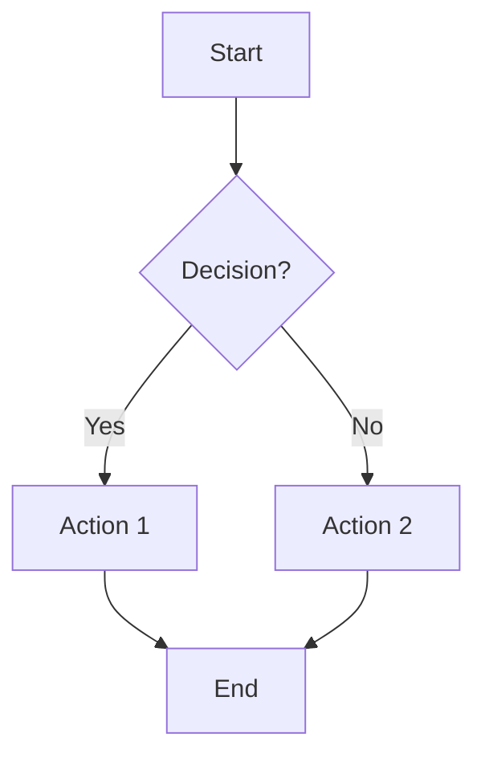
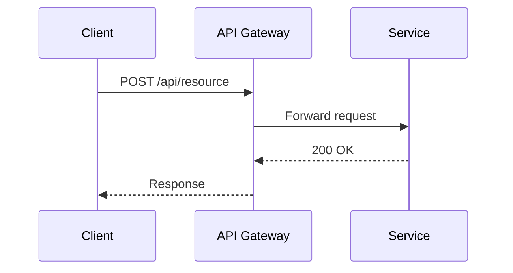
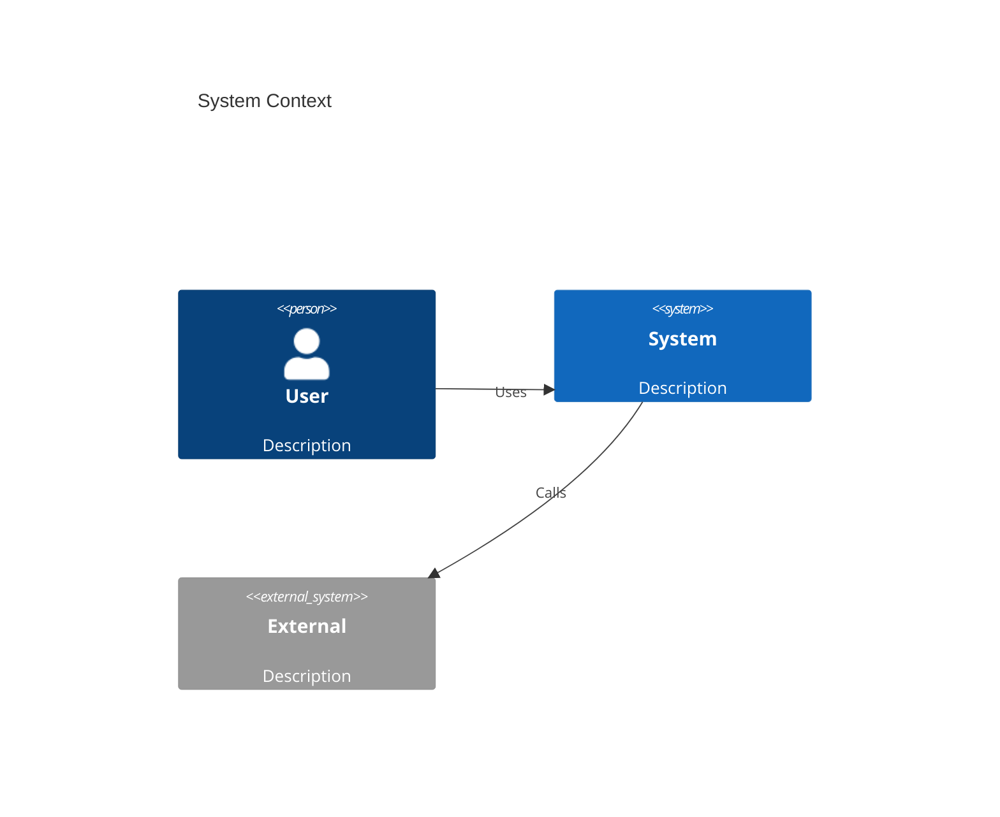
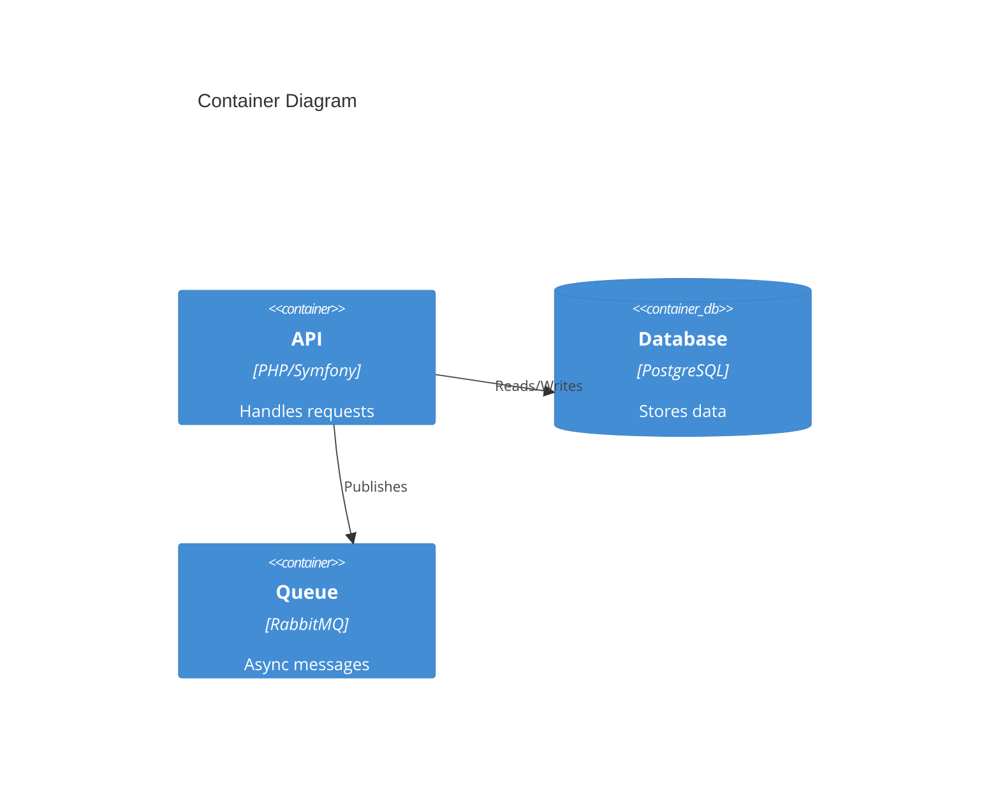

# Diagram Generator

Generate diagrams from natural language descriptions. Automatically selects the best engine based on diagram type.

## Tools Available

| Engine | Binary | Best for |
|--------|--------|----------|
| **Mermaid** | `mmdc` | Flowcharts, sequence, C4 context, class, state, ER diagrams |
| **PlantUML** | `plantuml` | AWS infrastructure, deployment, component diagrams with cloud icons |

## Output

- **Format**: PNG (default), SVG if user requests
- **Directory**: `~/diagrams/`
- **Naming**: `{YYYY-MM-DD}_{slug}.png` (slug derived from description, max 40 chars, lowercase, hyphens)

## Engine Selection Rules

Auto-select engine based on diagram content. User can override with explicit `engine:mermaid` or `engine:plantuml`.

| Diagram type | Engine | Why |
|-------------|--------|-----|
| Flowchart / decision flow | Mermaid | Clean syntax, good layout |
| Sequence diagram | Mermaid | Native support, readable |
| C4 Context / Container | Mermaid | Built-in C4 support |
| Class / ER diagram | Mermaid | Native support |
| State machine | Mermaid | Native support |
| **AWS infrastructure** | **PlantUML** | AWS sprites/icons |
| **Kubernetes / EKS** | **PlantUML** | K8s sprites |
| **Network / VPC** | **PlantUML** | Cloud networking icons |
| Deployment architecture | PlantUML | Component + cloud icons |
| Generic component diagram | PlantUML | Better for boxes + arrows at scale |

## Rendering Commands

### Mermaid

Write the diagram code to a temp file, then render:

```bash
SLUG=$(echo "description here" | tr '[:upper:]' '[:lower:]' | sed 's/[^a-z0-9]/-/g' | sed 's/--*/-/g' | cut -c1-40 | sed 's/-$//')
DATE=$(date +%Y-%m-%d)
OUTFILE="$HOME/diagrams/${DATE}_${SLUG}.png"
TMPFILE=$(mktemp)
mv "$TMPFILE" "${TMPFILE}.mmd"
TMPFILE="${TMPFILE}.mmd"

cat > "$TMPFILE" << 'DIAGRAM'
graph TD
    A[Start] --> B[End]
DIAGRAM

mmdc -i "$TMPFILE" -o "$OUTFILE" -b transparent -s 2 && rm "$TMPFILE"
echo "Diagram saved: $OUTFILE"
```

Options:
- `-s 2` = scale factor 2x for crisp output
- `-b transparent` = transparent background
- `-t dark` = dark theme (if user prefers)
- `-w 2048` = max width in pixels

### PlantUML

**IMPORTANT**: Use local AWS icon library at `~/diagrams/.plantuml-libs/aws-icons-for-plantuml-18.0/dist` for real AWS icons. Do NOT use the bundled `<awslib/...>` stdlib — it renders without graphical icons.

```bash
AWSLIB="$HOME/diagrams/.plantuml-libs/aws-icons-for-plantuml-18.0/dist"
SLUG=$(echo "description here" | tr '[:upper:]' '[:lower:]' | sed 's/[^a-z0-9]/-/g' | sed 's/--*/-/g' | cut -c1-40 | sed 's/-$//')
DATE=$(date +%Y-%m-%d)
OUTFILE="$HOME/diagrams/${DATE}_${SLUG}.png"
TMPFILE=$(mktemp)
mv "$TMPFILE" "${TMPFILE}.puml"
TMPFILE="${TMPFILE}.puml"

cat > "$TMPFILE" << EOF
@startuml
!define AWSPuml $AWSLIB
!include AWSPuml/AWSCommon.puml
!include AWSPuml/AWSSimplified.puml
!include AWSPuml/Containers/EKSCloud.puml
!include AWSPuml/Database/RDS.puml

EKSCloud(eks, "EKS Cluster", "v1.29")
RDS(rds, "PostgreSQL", "db.r6g.xlarge")
eks --> rds : "port 5432"
@enduml
EOF

plantuml -tpng "$TMPFILE" -o "$HOME/diagrams" && BASENAME=\$(basename "\${TMPFILE%.puml}") && mv "$HOME/diagrams/\${BASENAME}.png" "$OUTFILE" && rm -f "$TMPFILE"
echo "Diagram saved: $OUTFILE"
```

For SVG output, use `-tsvg` instead of `-tpng`.

## PlantUML AWS Icon Reference (Local Library v18)

**Base path**: `~/diagrams/.plantuml-libs/aws-icons-for-plantuml-18.0/dist`

Every PlantUML AWS diagram MUST start with:
```plantuml
!define AWSPuml $HOME/diagrams/.plantuml-libs/aws-icons-for-plantuml-18.0/dist
!include AWSPuml/AWSCommon.puml
!include AWSPuml/AWSSimplified.puml
```

For the full sprite reference, consult [references/aws-sprites.md](references/aws-sprites.md).

## Mermaid Syntax Reference

### Flowchart


### Sequence


### C4 Context


### C4 Container


## Workflow

1. **Parse user request**: Identify what type of diagram and what components
2. **Select engine**: Apply engine selection rules (or user override)
3. **Generate code**: Write the diagram code (Mermaid or PlantUML syntax)
4. **Show code to user**: Display the diagram source code for review before rendering
5. **Render**: Execute the rendering command
6. **Confirm**: Show the output file path and open it

After rendering, open the file for the user:
```bash
open "$OUTFILE"
```

## Interactive Mode

If no description provided or description is ambiguous, ask:
1. What do you want to diagram? (architecture, flow, sequence, infrastructure...)
2. What components/services are involved?
3. Any specific AWS/K8s services to include?

Then generate the diagram based on answers.

## Tips for Better Diagrams

- **Keep it simple**: 5-10 nodes max per diagram. Split complex architectures into multiple diagrams.
- **Use grouping**: PlantUML Groups (`VPCGroup`, `PrivateSubnetGroup`), Mermaid `subgraph` to organize.
- **Label connections**: Always label arrows with protocol/port/action.
- **Consistent direction**: Top-down (`TD`) for hierarchies, left-right (`LR`) for flows.

## Error Handling

- **`mmdc` not found**: Run `npm i -g @mermaid-js/mermaid-cli`
- **`plantuml` not found**: Run `brew install plantuml`
- **PlantUML sprites missing/no icons**: Ensure using local lib path `~/diagrams/.plantuml-libs/aws-icons-for-plantuml-18.0/dist`, NOT the bundled `<awslib/...>` stdlib
- **Mermaid syntax error**: `mmdc` outputs the error with line number. Fix and re-render.
- **Blank/empty PNG**: Usually a syntax error that didn't raise. Check the diagram code.
- **Puppeteer/Chrome errors with mmdc**: Run `npx puppeteer browsers install chrome`
- **`mktemp` collision**: Use `mktemp` without template suffix, then `mv` to add extension
